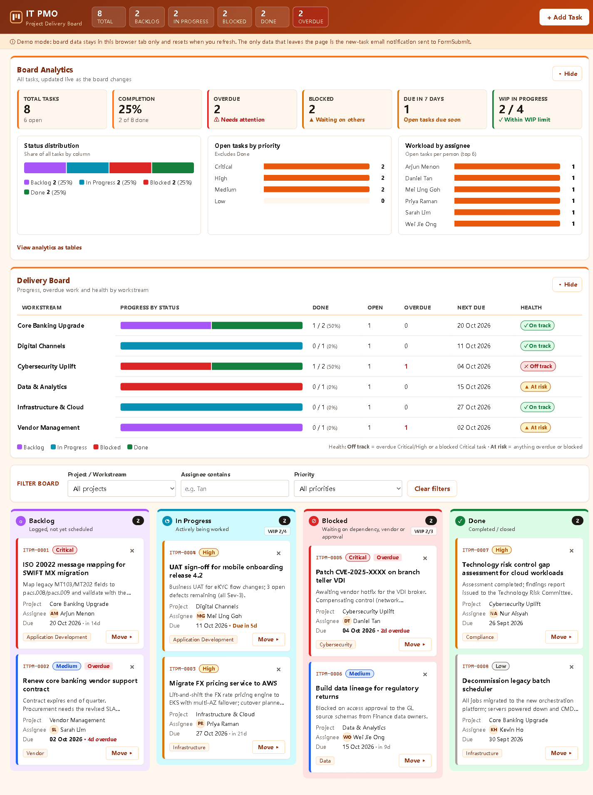

# IT PMO Kanban Board

A single-file Kanban board for a fictitious bank's internal IT Project Management Office, built for demos and training. It runs entirely in the browser with vanilla HTML, CSS and JavaScript (no frameworks, build step or external resources). New tasks can trigger an email notification through [FormSubmit](https://formsubmit.co).

**Live demo:** https://super211.github.io/claude/



## Features

- **Four-column board**: Backlog, In Progress, Blocked and Done, side by side on desktop and stacked below 768px. Each column shows a live task count.
- **Task cards** with ID (`ITPM-0001`), title, project/workstream, assignee, priority pill, due date, category tag and an **Overdue** badge. The left border is colour-coded by priority (Critical red, High amber, Medium blue, Low grey).
- **Drag and drop** between columns using the native HTML5 API, with a highlight on the column you're hovering over.
- **Keyboard-accessible move**: a **Move ▸** button on each card opens a menu of target columns. Esc closes it.
- **Inline delete confirmation** ("Delete? Yes / No") instead of a browser dialog.
- **Add Task form** in a modal, with inline validation: title (required, ≤80 chars), description (≤500), project, category, assignee, priority, due date (not in the past) and status.
- **Filter bar** by project, assignee (text contains) and priority. While a filter is active, column counts show `visible / total`.
- **Live summary strip** in the header: total tasks, a count per status, and overdue tasks.
- **Accessibility**: semantic HTML, labelled inputs, visible focus rings, `aria-label`s on icon buttons, a polite live region for toasts, and keyboard focus kept in place after the board re-renders.
- **Seed data**: 8 realistic demo tasks. Their due dates are set relative to today, so some are always overdue.

## Run locally

No install is needed. Either:

- double-click `index.html` to open it in a browser, or
- serve the folder, e.g. `python -m http.server`, then open http://localhost:8000.

## Configuration

Email notifications are sent to a single address, set at the top of the `<script>` block in `index.html`:

```js
const FORMSUBMIT_ENDPOINT = "https://formsubmit.co/ajax/YOUR_EMAIL@example.com";
```

Replace `YOUR_EMAIL@example.com` with the recipient address. Until you do, the app skips the request on purpose and shows a "Card added locally — email notification failed" warning. The card is still added.

FormSubmit needs a **one-time activation**. The first submission to a new address sends a confirmation email to it, and nothing is delivered until the link in that email is clicked.

New cards appear on the board straight away, and the email is sent in the background with a 15-second timeout. If it fails, you get a warning toast, but the card stays on the board.

## Tech stack and constraints

- One file, `index.html`: markup, one `<style>` block and one `<script>` block.
- Vanilla JavaScript with a single `state` object. Every change re-renders the board from that object.
- No external scripts, fonts or images. The icons are inline SVG and Unicode characters.
- FormSubmit's AJAX endpoint is the only network call.

## Deployment

`.github/workflows/pages.yml` deploys the site to GitHub Pages on every push to `main`, and can also be run manually. It copies only `index.html` into the published site, so repo files such as `CLAUDE.md` are not served. In the repository settings, the Pages source is **GitHub Actions**.

## Development tooling (Claude Code)

The repo includes project-level [Claude Code](https://claude.com/claude-code) tooling. None of it is part of the deployed site.

- **`/publish-github` command** (`.claude/commands/publish-github.md`): scans for secrets, pushes, deploys GitHub Pages, refreshes this README and its screenshot, and sets the repo About panel.
- **Playwright MCP** (`.mcp.json`): lets Claude drive a real browser for testing and screenshots.
- **Skills** (`.claude/skills/`): `cybersecurity-analyst`, `ui-ux-pro-max`, and the Agent Kanban skills `ak-task`, `ak-plan`, `ak-worker` and `ak-maintainer`. Sources are listed in `skills-lock.json`. The `ak-*` skills need the external Realmroot Toolbox, and the `ui-ux-pro-max` search scripts need Python 3.

## Limitations

- **No persistence.** Board data lives in memory only, so refreshing the page resets it to the demo tasks. The UI says so in a note under the header.
- There are no user accounts, and nothing is shared between viewers. Everyone sees their own copy of the board.
- Email notifications depend on FormSubmit being configured and activated.
